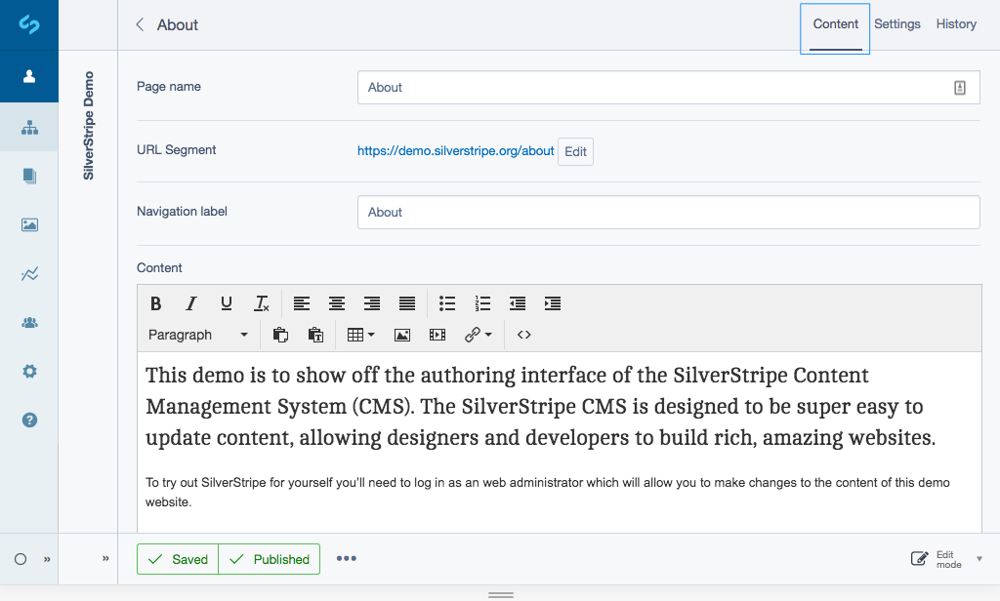
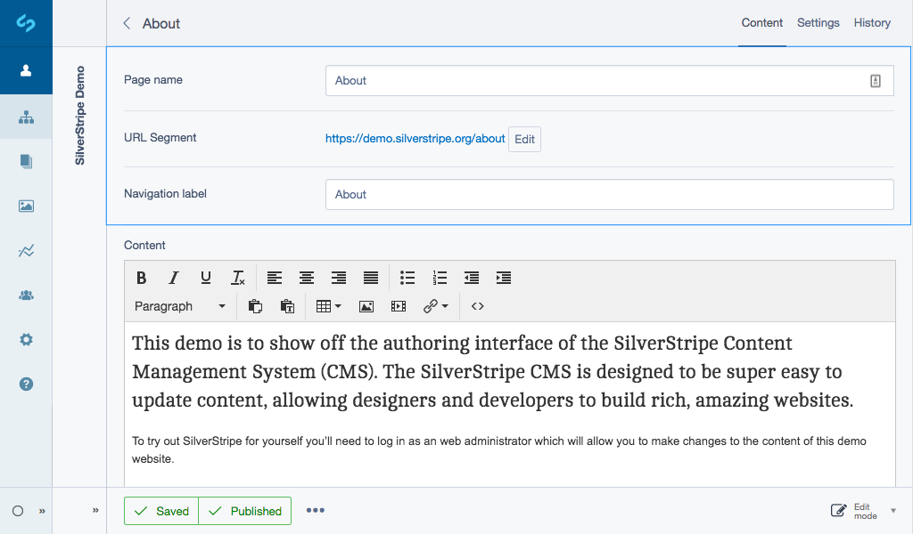
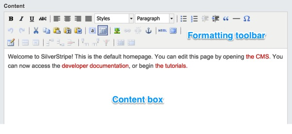

## Quick Reminder

 1. Go to the  tab
 2. Click on the page you wish to edit
 3. Make your required changes
 4. Click  to make your changes live

## Editing content

 1. In the Page Management Section, you will need to ensure you are on the 'Content' tab to use the WYSIWYG editor:

 2. For a standard content page, you can edit the following fields:

 * **Page name**: Appears at the top of the page, above the content.
 * **URL Segment**: The website address for the page
 * **Navigation Label**: How the page is labelled in the website navigation menu, usually the same as the Page name
 * **Content**: The main content for the page, can include structured text, images, links, lists etc.
 * **Metadata**: Hidden in a panel at the bottom of the interface, the content of these fields doesn't appear on the page, but instead is used by search engines.

[note]
If your website includes other features specific to all pages you may see other fields here too.
[/note]

3. Make your required changes to the fields, and then click the  or  button to save the changes and make them live.
Note: Every time you click on save draft button or save publish a snapshot of the page is saved in history, which you can then revert to at any time, see the [Rolling Back Pages](../pages/rolling_back_pages) help section.

## Formatting content

Generally, most items in the formatting toolbar will behave much like they would in any word processor.  There are a few exceptions.

For example, the Styles drop-down box allows you to add certain styles to a page.  This is primarily used to add image styles to a link of downloadable content, for example, links to PDF or Word documents, Excel spreadsheets, or images.

The Paragraph drop-down box allows you to choose a format for that paragraph in HTML code.  Most typed paragraphs will be in the normal "paragraph" format, but there are also six levels of "headings."  

Headings represent the outline organization of a document. H1 is generally considered the highest level of the document, while H6 is the lowest level. By using the "Heading" paragraph formats, it will automatically make all paragraphs marked with the same heading number the same format.  And, if you want to change the style of your page at a later date, your web designer will only need to change the heading definitions in one place, rather than changing the format of multiple headings in your text individually.  This can be a big timesaver!  

The "Blockquote" button (looks like " ) is used to offset text in what those in the newspaper industry call "pull-quotes." Simply highlight the text you want to offset, and press the blockquote button.  

Finally, the "Insert Horizontal Ruler" button will insert a horizontal line on the page, and the "Insert Special Character" button, marked by the Greek Omega symbol, is used to insert special characters into the text.  This is useful for foreign loanwords with special symbols, such as "resumé," proper names such as "François Mitterrand," and metal umlauts, such as "Mötley Crüe"

There is one other button that needs explanation.  That is the button marked "HTML." If you want to go in and edit the source code of the page directly, pressing the HTML button will bring up the HTML source of the page.  It is recommended that you only do this if you have a good knowledge of HTML formatting. This can be useful when you need to directly add some source code to a page, for example, when embedding YouTube videos.

### Cutting and pasting from a Word Processor

You may want to bring some text you have already written on a word processor, such as Microsoft Word into your page content.

Generally, you can paste any text from a "plain text editor" such as Notepad.exe on Windows systems, TextEdit.app on Macintosh systems, and gEdit on Ubuntu Linux, et al.

Pasting directly from most word processors or other application often inserts bits of "rich text" formatting code that usually doesn't work well with the HTML markup code used on Websites. SilverStripe offers two solutions to this problem.

The first is **Paste as Text**, it removes all formatting from copied text before adding it to the website.

The second is **Paste from Word**, where SilverStripe takes the "rich text" formatting code from Microsoft Word, and translates that into HTML markup code. However, this only works with Microsoft Word, and not with other word processors such as OpenOffice.org, Word Perfect, or Apple Pages.  

## Describing your content with metadata

It's not just enough to create good content that informs your readers. You also need to let your readers find the content they're looking for. You can help your readers find your content by adding metadata. Metadata is page-specific blocks of text, normally hidden from general browsers, which search engines use to classify the page on the internet.  

In the lower portion of the Page Management section, beneath the Content Box for the page you want to describe, is the "Metadata" area. Here, you can also enter a description and keywords for your site.  If your web manager has asked you to add any additional metadata, you can do so from this section of Page Management as well.
