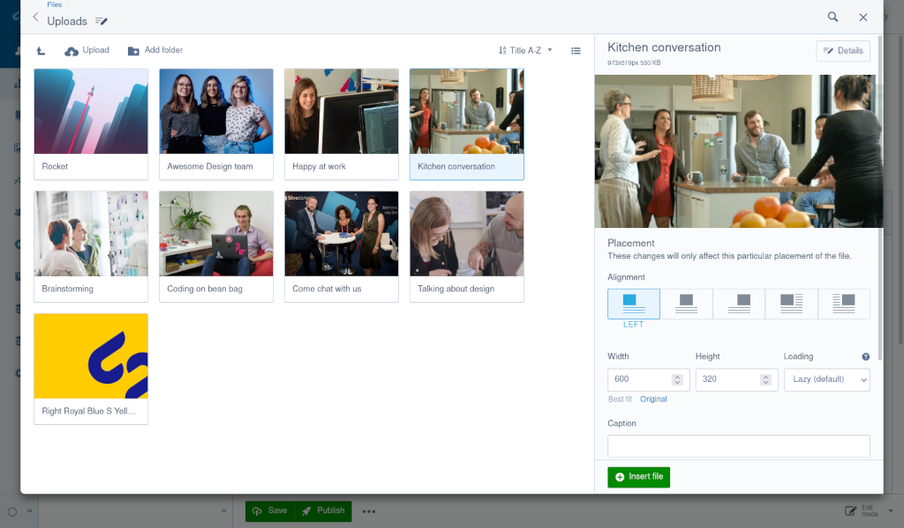

# Inserting images

## Inserting an image (HTML editor)
1. Position the text cursor where you want to insert the top of the image. To keep things tidy it's usually best if you place the image on it's own line, or at the very start of a paragraph.
2. Click the button **Insert from files** shown as a file icon in the HTML editor.
3. Click the button ***Upload***. You can also drag & drop files from your computer or select an image from the CMS.
4. Locate the image(s) you'd like to insert, and click the button **Open**.
5. Once the image(s) have uploaded click the button ***Insert file***. You can select the image in the HTML editor and drag the drag handles to resize to your required size.

[note]
Image files for a website must be in either JPG, GIF or PNG format. If your image currently exists in a Word or Publisher file, you must first save the image as one of these file types.
[/note]

## Setting the alignment of an image

1. Select the image and click the button ***Insert from files*** shown as a file icon in the HTML editor.
2. Navigate to the ***Placement*** tab.
3. Select the alignment for your image from the ***Alignment*** dropdown field.
* Left
* Center
* Left or right wrap
4. Click the ***Insert file*** button.

## Repositioning an Image

To change the position of an image that you have inserted, simply click and drag it, moving the text cursor to the position you want to move the image to. Remember, the text cursor position only defines the position of the top of the image, so you're best dragging it to the very start of a paragraph, or onto its own line.

## Controlling the loading of images {#lazy-loading}

Modern web browsers can delay the loading of images until the image is about to be displayed to the user. This feature is called "lazy loading", as opposed to "eager loading" where the browser downloads images on page load even if the user can not see them. 

Lazy loading reduces the time it takes display the page to users. By default, Silverstripe CMS will lazy load any image you insert into an HTML editor.

If an image is placed near the top of the page and you expect it to be immediately visible to users, you may wish to eager load it.

To force an image in an HTML editor to eager load:

1. Select the image and click the button ***Insert from files*** shown as a file icon in the HTML editor.
2. Navigate to the ***Placement*** tab.
3. Select ***Eager*** from the ***Loading*** dropdown field.
4. Click the ***Insert file*** button.
